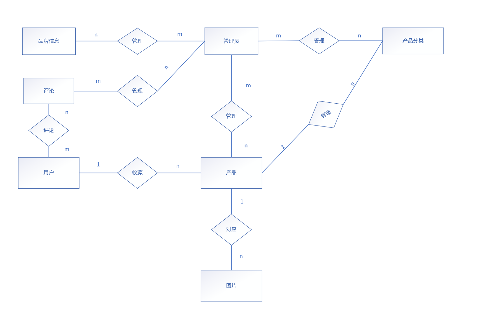

# README

## 1.项目背景

本课题来源于日常生活中用户对手机、电脑等数码产品信息查询和配置对比的实际需求随着数码产品更新速度不断加快，市场上的手机、电脑品牌和型号越来越多，不同产品在价格、处理器、内存、存储容量、屏幕尺寸、电池容量、摄像头、显卡等配置方面存在较大差异

 用户在购买数码产品前，通常需要通过多个平台查询产品信息，并对不同产品的参数进行人工比较这种方式不仅效率较低，而且容易出现信息分散、数据不统一、对比不直观等问题因此，有必要设计一个数码产品信息管理与配置对比系统，对手机、电脑等产品的基本信息和详细配置进行集中管理 

本系统以数码产品信息管理为基础，以产品配置查询和对比为特色，通过数据库存储用户、管理员、产品分类、品牌、产品、配置参数、产品图片、收藏和评论等信息，实现数码产品数据的统一管理、快速查询和直观对比

## 2.需求分析

### 2.1  信息需求

通过对数码产品信息管理与配置对比系统的分析，可以确定系统需要保存以下几类信息：

1. 用户基本信息：包括用户编号、用户名、密码、手机号、邮箱、性别、用户状态、注册时间等信息
2. 管理员信息：包括管理员编号、管理员账号、管理员密码、管理员姓名、联系电话、邮箱、权限角色、账号状态等信息
3. 产品分类信息：包括分类编号、分类名称、父级分类编号、分类描述、排序号、分类图标、分类状态等信息
4. 品牌信息：包括品牌编号、品牌名称、品牌Logo、所属国家、官方网站、品牌介绍、品牌状态等信息
5. 产品基本信息：包括产品编号、产品名称、所属分类、所属品牌、产品价格、产品主图、产品简介、浏览量、发布时间、产品状态等信息
6. 手机配置信息：包括手机配置编号、产品编号、处理器、运行内存、存储容量、屏幕尺寸、屏幕刷新率、电池容量、充电功率、摄像头像素、系统版本、网络类型等信息
7. 电脑配置信息：包括电脑配置编号、产品编号、CPU、显卡、内存、硬盘容量、屏幕尺寸、屏幕刷新率、电池容量、重量、系统版本、接口类型等信息
8. 产品图片信息：包括图片编号、产品编号、图片地址、图片名称、图片类型、图片描述、是否主图、排序号、上传时间、图片状态等信息
9. 收藏信息：包括收藏编号、用户编号、产品编号、收藏时间、收藏分组、备注、收藏来源页面、收藏状态等信息
10. 评论信息：包括评论编号、用户编号、产品编号、评分、评论内容、评论时间、点赞数、回复数、评论状态、审核管理员编号等信息

根据系统信息需求分析，各类数据之间存在如下关系：

1. 一个管理员可以创建或维护多个产品分类，一个产品分类由一个管理员进行管理
2. 一个管理员可以添加或维护多个品牌信息，一个品牌信息由管理员进行管理
3. 一个管理员可以添加或维护多个产品，一个产品信息由管理员进行录入或修改
4. 一个产品分类下可以包含多个产品，但一个产品只能属于一个分类
5. 一个品牌可以拥有多个产品，但一个产品只能属于一个品牌
6. 一部手机对应一条手机配置记录，一条手机配置记录也只能对应一部手机
7. 一台电脑对应一条电脑配置记录，一条电脑配置记录也只能对应一台电脑
8. 一个产品可以拥有多张图片，一张图片只能属于一个产品
9. 一个用户可以收藏多个产品，一个用户可以对应多条收藏记录
10. 一个产品可以被多个用户收藏，一个产品对应多条收藏记录
11. 一个用户可以对多个产品发表评论，因此一个用户可以对应多条评论记录
12. 一个产品可以拥有多条用户评论，一个产品可以对应多条评论记录
13. 一个管理员可以管理多条评论信息，一条评论由一个管理员管理。

### 2.2 处理需求

本系统主要面向普通用户和管理员两类角色，不同角色具有不同的操作需求

普通用户的主要处理需求如下：

（1）用户可以进行注册和登录，登录后可以使用收藏、评论等功能

（2）用户可以浏览手机、电脑等数码产品信息，查看产品名称、品牌、价格、图片和简介等内容

（3）用户可以根据产品名称、分类、品牌、价格等条件查询产品信息

（4）用户可以查看产品详情，包括产品基本信息、产品图片、手机配置或电脑配置等内容

（5）用户可以选择两个或多个产品进行配置对比，系统以表格形式展示产品之间的价格、处理器、内存、存储、屏幕、电池、摄像头或显卡等差异

（6）用户可以收藏感兴趣的产品，也可以查看或取消自己的收藏记录

（7）用户可以对产品进行评分和评论，发表自己对产品的看法

管理员的主要处理需求如下：

（1）管理员可以登录后台管理系统

（2）管理员可以对用户信息进行查看、修改、禁用或删除

（3）管理员可以对产品分类信息进行添加、修改、删除和查询

（4）管理员可以对品牌信息进行添加、修改、删除和查询

（5）管理员可以对产品基础信息进行添加、修改、删除和查询

（6）管理员可以维护手机配置和电脑配置信息，保证产品配置数据准确

（7）管理员可以管理产品图片，包括上传、修改、删除和设置主图

（8）管理员可以查看和管理用户评论，对不合适的评论进行隐藏或删除

### 2.3 安全性和完整性要求

为了保证系统数据的安全性和完整性，需要满足以下要求：

（1）安全性要求：普通用户和管理员需要通过账号和密码登录系统，不同角色拥有不同的操作权限

（2）用户权限要求：普通用户只能查看产品信息、收藏产品、评论产品和管理自己的个人信息，不能修改系统中的产品、品牌和分类数据

（3）管理员权限要求：管理员可以对用户、产品、分类、品牌、配置、图片和评论等信息进行管理

（4）数据完整性要求：产品信息必须关联正确的产品分类和品牌，手机配置或电脑配置必须关联对应的产品

（5）主键唯一性要求（实体完整性）：每张表中的主键必须唯一

（6）外键约束要求（参照完整性）：收藏表和评论表中的用户编号必须来自用户表，产品编号必须来自产品表；产品表中的分类编号和品牌编号必须分别来自分类表和品牌表

（7）数据合理性要求：产品价格不能小于0，评分应在规定范围（1-5）内，用户状态、产品状态、评论状态等字段应使用统一的状态值

（8）数据一致性要求：当产品、用户或评论信息发生修改时，相关数据应保持一致，避免出现无效数据或错误关联

## 3.概念结构设计

首先是对应实体存在的关系

1. 一个管理员可以管理多个产品分类，一个产品分类由多个管理员进行管理
2. 一个管理员可以添加或维护多个品牌信息，一个品牌信息由管理员进行管理
3. 一个管理员可以添加或维护多个产品，一个产品信息由多个管理员进行录入或修改
4. 一个产品分类下可以包含多个产品，但一个产品只能属于一个分类
5. 一个品牌可以拥有多个产品，但一个产品只能属于一个品牌
8. 一个产品可以拥有多张图片，一张图片只能属于一个产品
9. 一个用户可以收藏多个产品，一条收藏记录只属于一个用户
10. 一个用户可以对多个产品发表评论，一个产品可以被多个用户评论
11. 一个管理员可以管理多条评论信息，一条评论由多个管理员管理

## 4.逻辑结构设计

## 5.物理结构设计

数据字典：

用户users

| 字段名     | 数据类型     | 约束             | 说明                       |
| ---------- | ------------ | ---------------- | -------------------------- |
| user_id    | int          | 主键，自增，非空 | 用户id                     |
| username   | varchar(50)  | 非空，唯一       | 用户名                     |
| password   | varchar(100) | 非空             | 用户密码                   |
| phone      | varchar(11)  | 非空             | 用户电话                   |
| email      | varchar(60)  | 可空             | 用户邮箱                   |
| gender     | varchar(3)   | 可空             | 用户性别                   |
| status     | int          | 非空             | 用户状态，1为正常，0为禁用 |
| created_at | datetime     | 非空             | 注册时间                   |
| updated_at | datetime     | 可空             | 更新信息时间               |

管理员admins

| 字段名        | 数据类型     | 约束             | 说明                             |
| ------------- | ------------ | ---------------- | -------------------------------- |
| admin_id      | int          | 主键，自增，非空 | 管理员id                         |
| admin_account | varchar(50)  | 非空，唯一       | 管理员账号                       |
| password      | varchar(100) | 非空             | 管理员密码                       |
| phone         | varchar(11)  | 非空             | 管理员电话                       |
| email         | varchar(60)  | 可空             | 管理员邮箱                       |
| role          | varchar(5)   | 可空             | 管理员权限                       |
| status        | int          | 非空             | 管理员账号状态，1为正常，0为禁用 |
| created_at    | datetime     | 非空             | 注册时间                         |
| updated_at    | datetime     | 可空             | 更新信息时间                     |

种类categories

| 字段名        | 数据类型     | 约束             | 说明                   |
| ------------- | ------------ | ---------------- | ---------------------- |
| category_id   | int          | 主键，自增，非空 | 分类id                 |
| category_name | varchar(50)  | 非空             | 分类名称               |
| parent_id     | varchar(100) | 可空             | 父级分类id             |
| description   | varchar(11)  | 可空             | 分类描述               |
| sort_order    | varchar(60)  | 可空             | 排序号                 |
| status        | int          | 非空             | 分类状态，1启用，0禁用 |
| created_by    | int          | 外键，可空       | 创建管理员ID           |
| created_at    | datetime     | 非空             | 注册时间               |
| updated_at    | datetime     | 可空             | 更新信息时间           |

注：created_by 关联 admins(admin_id)

品牌brands

| 字段名      | 数据类型 | 约束 | 说明 |
| ----------- | -------- | ---- | ---- |
| brand_id    | int      |      |      |
| brand_name  |          |      |      |
| logo        |          |      |      |
| country     |          |      |      |
| website     |          |      |      |
| description |          |      |      |
| status      |          |      |      |
| created_at  |          |      |      |
| updated_at  |          |      |      |

产品products

| 字段名       | 数据类型 | 约束 | 说明 |
| ------------ | -------- | ---- | ---- |
| product_id   |          |      |      |
| product_name |          |      |      |
| category_id  |          |      |      |
| price        |          |      |      |
| description  |          |      |      |
| cover_image  |          |      |      |
| view_count   |          |      |      |
| release_date |          |      |      |
| status       |          |      |      |
|              |          |      |      |
|              |          |      |      |
|              |          |      |      |

phone_specs手机配置表

| 字段名 | 数据类型 | 约束 | 说明 |
| ------ | -------- | ---- | ---- |
|        |          |      |      |
|        |          |      |      |
|        |          |      |      |
|        |          |      |      |
|        |          |      |      |
|        |          |      |      |
|        |          |      |      |
|        |          |      |      |
|        |          |      |      |
|        |          |      |      |
|        |          |      |      |
|        |          |      |      |

computer_specs电脑配置

| 字段名 | 数据类型 | 约束 | 说明 |
| ------ | -------- | ---- | ---- |
|        |          |      |      |
|        |          |      |      |
|        |          |      |      |
|        |          |      |      |
|        |          |      |      |
|        |          |      |      |
|        |          |      |      |
|        |          |      |      |
|        |          |      |      |
|        |          |      |      |
|        |          |      |      |
|        |          |      |      |

产品图片product_images

| 字段名 | 数据类型 | 约束 | 说明 |
| ------ | -------- | ---- | ---- |
|        |          |      |      |
|        |          |      |      |
|        |          |      |      |
|        |          |      |      |
|        |          |      |      |
|        |          |      |      |
|        |          |      |      |
|        |          |      |      |
|        |          |      |      |
|        |          |      |      |

收藏favorites

| 字段名 | 数据类型 | 约束 | 说明 |
| ------ | -------- | ---- | ---- |
|        |          |      |      |
|        |          |      |      |
|        |          |      |      |
|        |          |      |      |
|        |          |      |      |
|        |          |      |      |
|        |          |      |      |
|        |          |      |      |
|        |          |      |      |
|        |          |      |      |

评论comments

| 字段名 | 数据类型 | 约束 | 说明 |
| ------ | -------- | ---- | ---- |
|        |          |      |      |
|        |          |      |      |
|        |          |      |      |
|        |          |      |      |
|        |          |      |      |
|        |          |      |      |
|        |          |      |      |
|        |          |      |      |
|        |          |      |      |
|        |          |      |      |
|        |          |      |      |

