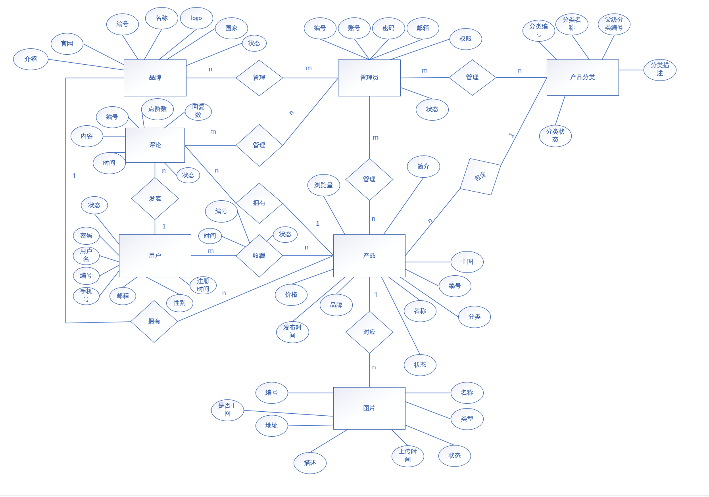

# README

## 1.项目背景

本课题来源于日常生活中用户对手机、电脑等数码产品信息查询和配置对比的实际需求随着数码产品更新速度不断加快，市场上的手机、电脑品牌和型号越来越多，不同产品在价格、处理器、内存、存储容量、屏幕尺寸、电池容量、摄像头、显卡等配置方面存在较大差异

 用户在购买数码产品前，通常需要通过多个平台查询产品信息，并对不同产品的参数进行人工比较这种方式不仅效率较低，而且容易出现信息分散、数据不统一、对比不直观等问题因此，有必要设计一个数码产品信息管理与配置对比系统，对手机、电脑等产品的基本信息和详细配置进行集中管理 

本系统以数码产品信息管理为基础，以产品配置查询和对比为特色，通过数据库存储用户、管理员、产品分类、品牌、产品、配置参数、产品图片、收藏和评论等信息，实现数码产品数据的统一管理、快速查询和直观对比

## 2.需求分析

### 2.1  信息需求

通过对数码产品信息管理与配置对比系统的分析，可以确定系统需要保存以下几类信息：

1. 用户基本信息：包括用户编号、用户名、密码、手机号、邮箱、性别、用户状态、注册时间
2. 管理员信息：包括管理员编号、管理员账号、管理员密码、邮箱、权限角色、账号状态
3. 产品分类信息：包括分类编号、分类名称、父级分类编号、分类描述、排序号、分类图标、分类状态等信息
4. 品牌信息：包括品牌编号、品牌名称、品牌Logo、所属国家、官方网站、品牌介绍、品牌状态等信息
5. 产品基本信息：包括产品编号、产品名称、所属分类、所属品牌、产品价格、产品主图、产品简介、浏览量、发布时间、产品状态等信息
8. 产品图片信息：包括图片编号、产品编号、图片地址、图片名称、图片类型、图片描述、是否主图、上传时间、图片状态等信息
10. 评论信息：包括评论编号、评论内容、评论时间、点赞数、回复数、评论状态

根据系统信息需求分析，各类数据之间存在如下关系：

1. 一个管理员可以管理多个产品分类，一个产品分类由多个管理员进行管理
2. 一个管理员可以添加或维护多个品牌信息，一个品牌信息由多个管理员进行管理
3. 一个管理员可以添加或维护多个产品，一个产品信息由多个管理员进行录入或修改
4. 一个产品分类下可以包含多个产品，但一个产品只能属于一个分类
5. 一个品牌可以拥有多个产品，但一个产品只能属于一个品牌
6. 一个产品可以拥有多张图片，一张图片只能属于一个产品
7. 一个用户可以收藏多个产品，一个产品也可以被多个用户收藏
8. 一个用户可以对多个产品发表评论，一个产品可以被多个用户评论
9. 一个管理员可以管理多条评论信息，一条评论由多个管理员管理
10. 一个产品拥有多个评论，一个评论对应一个产品

### 2.2 处理需求

本系统主要面向普通用户和管理员两类角色，不同角色具有不同的操作需求

普通用户的主要处理需求如下：

（1）用户可以进行注册和登录，登录后可以使用收藏、评论等功能

（2）用户可以浏览手机、电脑等数码产品信息，查看产品名称、品牌、价格、图片和简介等内容

（3）用户可以根据产品名称、分类、品牌、价格等条件查询产品信息

（4）用户可以查看产品详情，包括产品基本信息、产品图片、手机配置或电脑配置等内容

（5）用户可以选择两个或多个产品进行配置对比，系统以表格形式展示产品之间的价格、处理器、内存、存储、屏幕、电池、摄像头或显卡等差异

（6）用户可以收藏感兴趣的产品，也可以查看或取消自己的收藏记录

（7）用户可以对产品进行评分和评论，发表自己对产品的看法

管理员的主要处理需求如下：

（1）管理员可以登录后台管理系统

（2）管理员可以对用户信息进行查看、修改、禁用或删除

（3）管理员可以对产品分类信息进行添加、修改、删除和查询

（4）管理员可以对品牌信息进行添加、修改、删除和查询

（5）管理员可以对产品基础信息进行添加、修改、删除和查询

（6）管理员可以维护手机配置和电脑配置信息，保证产品配置数据准确

（7）管理员可以管理产品图片，包括上传、修改、删除和设置主图

（8）管理员可以查看和管理用户评论，对不合适的评论进行隐藏或删除

### 2.3 安全性和完整性要求

为了保证系统数据的安全性和完整性，需要满足以下要求：

（1）安全性要求：普通用户和管理员需要通过账号和密码登录系统，不同角色拥有不同的操作权限

（2）用户权限要求：普通用户只能查看产品信息、收藏产品、评论产品和管理自己的个人信息，不能修改系统中的产品、品牌和分类数据

（3）管理员权限要求：管理员可以对用户、产品、分类、品牌、配置、图片和评论等信息进行管理

（4）数据完整性要求：产品信息必须关联正确的产品分类和品牌，手机配置或电脑配置必须关联对应的产品

（5）主键唯一性要求（实体完整性）：每张表中的主键必须唯一

（6）外键约束要求（参照完整性）：收藏表和评论表中的用户编号必须来自用户表，产品编号必须来自产品表；产品表中的分类编号和品牌编号必须分别来自分类表和品牌表

（7）数据合理性要求：产品价格不能小于0，评分应在规定范围（1-5）内，用户状态、产品状态、评论状态等字段应使用统一的状态值

（8）数据一致性要求：当产品、用户或评论信息发生修改时，相关数据应保持一致，避免出现无效数据或错误关联

## 3.概念结构设计

首先是对应实体存在的关系

1. 一个管理员可以管理多个产品分类，一个产品分类由多个管理员进行管理
2. 一个管理员可以添加或维护多个品牌信息，一个品牌信息由多个管理员进行管理
3. 一个管理员可以添加或维护多个产品，一个产品信息由多个管理员进行录入或修改
4. 一个产品分类下可以包含多个产品，但一个产品只能属于一个分类
5. 一个品牌可以拥有多个产品，但一个产品只能属于一个品牌
6. 一个产品可以拥有多张图片，一张图片只能属于一个产品
7. 一个用户可以收藏多个产品，一个产品也可以被多个用户收藏
8. 一个用户可以对多个产品发表评论，一个产品可以被多个用户评论
9. 一个管理员可以管理多条评论信息，一条评论由多个管理员管理
10. 一个产品拥有多个评论，一个评论对应一个产品

由以上关系，可以得出如下E-R图

## 4.逻辑结构设计

### 4.1 关系模式设计

管理员（<u>管理员编号</u>，管理员账号，管理员密码，邮箱，权限角色，账号状态）

产品分类（<u>分类编号</u>，分类名称，父级分类编号，分类描述，排序号，分类图标，分类状态）

品牌（<u>品牌编号</u>，品牌名称，品牌Logo，所属国家，官方网站，品牌介绍，品牌状态）

产品（<u>产品编号</u>，产品名称，分类编号，品牌编号，产品价格，产品主图，产品简介，浏览量，发布时间，产品状态）

产品图片（<u>图片编号</u>，产品编号，图片地址，图片名称，图片类型，图片描述，是否主图，上传时间，图片状态）

用户（<u>用户编号</u>，用户名，密码，手机号，邮箱，性别，用户状态，注册时间）

评论（<u>评论编号</u>，用户编号，产品编号，评论内容，评论时间，点赞数，回复数，评论状态）

管理员分类管理（<u>管理员编号，分类编号</u>）

管理员品牌管理（<u>管理员编号，品牌编号</u>）
管理员产品管理（<u>管理员编号，产品编号</u>）

收藏（<u>收藏编号</u>，用户编号，产品编号，收藏时间，收藏状态）

管理员评论管理（<u>管理员编号，评论编号</u>）

==注：横线代表主键，波浪线代表外键==

### 4.2 关系模式优化

由上面关系模式设计可知：

1. 管理员关系中所有非主属性都完全依赖于管理员编号，属于 BCNF
2. 产品分类关系中分类名称、父级分类编号、分类描述、排序号、分类图标、分类状态都依赖于分类编号，属于 BCNF
3. 品牌关系中所有非主属性都完全依赖于品牌编号，属于 BCNF
4. 产品关系中产品名称、分类编号、品牌编号、产品价格、产品简介、浏览量、发布时间、产品状态都依赖于产品编号，属于 BCNF
5. 产品图片关系中所有非主属性都完全依赖于图片编号，且产品编号作为外键用于表示产品与图片之间的 1:n 关系，属于 BCNF
6. 用户关系中所有非主属性都完全依赖于用户编号，属于 BCNF
7. 评论关系中评论内容、评论时间、点赞数、回复数、评论状态都依赖于评论编号，用户编号和产品编号作为外键分别表示用户发表评论、产品拥有评论的关系，属于 BCNF
8. 管理员分类管理由管理员编号和分类编号两个外键共同组成联合主键，表中不存在非主属性，属于 BCNF
9. 管理员品牌管理由管理员编号和品牌编号两个外键共同组成联合主键，表中不存在非主属性，属于 BCNF
10. 管理员产品管理由管理员编号和产品编号两个外键共同组成联合主键，表中不存在非主属性，属于 BCNF
11. 管理员评论管理由管理员编号和评论编号两个外键共同组成联合主键，表中不存在非主属性，属于 BCNF
12. 收藏关系中收藏时间、收藏状态依赖于用户编号和产品编号组成的联合主键，用户编号和产品编号同时作为外键，属于 BCNF

由此可见，所有关系模式均已到达BCNF

但是产品主图可以由产品图片表中是否主图推出，属于冗余设计，故可以把产品表中的产品主图去掉，利用是否主图来进行判断即可

优化以后的：

管理员（<u>管理员编号</u>，管理员账号，管理员密码，邮箱，权限角色，账号状态）

产品分类（<u>分类编号</u>，分类名称，父级分类编号，分类描述，排序号，分类图标，分类状态）

品牌（<u>品牌编号</u>，品牌名称，品牌Logo，所属国家，官方网站，品牌介绍，品牌状态）

产品（<u>产品编号</u>，产品名称，分类编号，品牌编号，产品价格，产品简介，浏览量，发布时间，产品状态）

产品图片（<u>图片编号</u>，产品编号，图片地址，图片名称，图片类型，图片描述，是否主图，上传时间，图片状态）

用户（<u>用户编号</u>，用户名，密码，手机号，邮箱，性别，用户状态，注册时间）

评论（<u>评论编号</u>，用户编号，产品编号，评论内容，评论时间，点赞数，回复数，评论状态）

管理员分类管理（<u>管理员编号，分类编号</u>）

管理员品牌管理（<u>管理员编号，品牌编号</u>）
管理员产品管理（<u>管理员编号，产品编号</u>）

收藏（收藏编号，<u>用户编号，产品编号</u>，收藏时间，收藏状态）

管理员评论管理（<u>管理员编号，评论编号</u>）

## 5.物理结构设计

### 5.1 确定存储引擎

由于信息化数据管理平台涉及的应用需要多次进行增删改查操作,因此,该平台数据库采用MySQL的Innodb存储引擎。

### 5.2 数据表设计

在实际应用过程中，为了便于数据库实现和系统开发，本系统在数据表设计时根据关系模式设置主键和外键，以保证数据的完整性和一致性。

管理员模块中设置管理员信息表，用于保存后台管理员的账号及权限信息。该表以 admin_id 作为主键，用于唯一标识每一位管理员。管理员账号 admin_account 设置为唯一约束，保证不同管理员账号不重复。管理员密码 admin_password 用于保存登录密码，email 用于保存管理员邮箱，role 用于区分管理员权限角色，status 用于表示账号状态。通过该表可以实现管理员登录、权限区分以及账号状态管理。具体关系表如表所示

admin

| 字段名         | 数据类型 | 默认值 | 数据长度 | 是否主键 | 是否为空 | 是否外键 | 自定义约束 | 说明                       |
| -------------- | -------- | ------ | -------- | -------- | -------- | -------- | ---------- | -------------------------- |
| admin_id       | int      |        | 10       | 是       | 否       | 否       |            | 管理员编号                 |
| admin_account  | varchar  |        | 30       | 否       | 否       | 否       | 唯一       | 管理员账号                 |
| admin_password | varchar  |        | 50       | 否       | 否       | 否       |            | 管理员密码                 |
| email          | varchar  |        | 45       | 否       | 是       | 否       |            | 管理员邮箱                 |
| role           | varchar  |        | 5        | 否       | 否       | 否       |            | 管理员权限                 |
| status         | int      | 1      | 1        | 否       | 否       | 否       |            | 账号状态，0为禁用，1为启用 |

产品分类表用于存储产品分类信息，其中 category_id 为主键，parent_id 为外键，用于表示父级分类编号，status 字段表示分类状态。

categories

| 字段名        | 数据类型 | 默认值 | 数据长度 | 是否主键 | 是否为空 | 是否外键 | 自定义约束       | 说明                   |
| ------------- | -------- | ------ | -------- | -------- | -------- | -------- | ---------------- | ---------------------- |
| category_id   | int      |        | 10       | 是       | 否       | 否       | 自增             | 分类编号               |
| category_name | varchar  |        | 50       | 否       | 否       | 否       |                  | 分类名称               |
| parent_id     | int      |        | 10       | 否       | 是       | 是       | 关联 category_id | 父级分类编号           |
| description   | varchar  |        | 255      | 否       | 是       | 否       |                  | 分类描述               |
| sort_order    | int      | 0      | 10       | 否       | 是       | 否       |                  | 排序号                 |
| icon          | varchar  |        | 255      | 否       | 是       | 否       |                  | 分类图标               |
| status        | int      | 1      | 1        | 否       | 否       | 否       |                  | 分类状态，1启用，0禁用 |

品牌信息表用于存储产品品牌信息，其中 brand_id 为主键，brand_name 字段设置唯一约束，用于保证品牌名称不重复，status 字段表示品牌状态。

brands

| 字段名      | 数据类型 | 默认值 | 数据长度 | 是否主键 | 是否为空 | 是否外键 | 自定义约束 | 说明                   |
| ----------- | -------- | ------ | -------- | -------- | -------- | -------- | ---------- | ---------------------- |
| brand_id    | int      |        | 10       | 是       | 否       | 否       | 自增       | 品牌编号               |
| brand_name  | varchar  |        | 50       | 否       | 否       | 否       | 唯一       | 品牌名称               |
| logo        | varchar  |        | 255      | 否       | 是       | 否       |            | 品牌Logo               |
| country     | varchar  |        | 50       | 否       | 是       | 否       |            | 所属国家               |
| website     | varchar  |        | 255      | 否       | 是       | 否       |            | 官方网站               |
| description | varchar  |        | 500      | 否       | 是       | 否       |            | 品牌介绍               |
| status      | int      | 1      | 1        | 否       | 否       | 否       |            | 品牌状态，1启用，0禁用 |

产品信息表用于存储产品基本信息，其中 product_id 为主键，category_id 和 brand_id 为外键，分别表示产品所属分类和所属品牌，price 字段表示产品价格，status 字段表示产品状态。

products

| 字段名       | 数据类型 | 默认值 | 数据长度 | 是否主键 | 是否为空 | 是否外键 | 自定义约束 | 说明                                     |
| ------------ | -------- | ------ | -------- | -------- | -------- | -------- | ---------- | ---------------------------------------- |
| product_id   | int      |        | 10       | 是       | 否       | 否       | 自增       | 产品编号                                 |
| product_name | varchar  |        | 100      | 否       | 否       | 否       |            | 产品名称                                 |
| category_id  | int      |        | 10       | 否       | 否       | 是       |            | 分类编号，关联categories中的 category_id |
| brand_id     | int      |        | 10       | 否       | 否       | 是       |            | 品牌编号，关联brands中的brand_id         |
| price        | double   | 0.00   | 8        | 否       | 否       | 否       | price >= 0 | 产品价格                                 |
| description  | varchar  |        | 500      | 否       | 是       | 否       |            | 产品简介                                 |
| view_count   | int      | 0      | 10       | 否       | 否       | 否       |            | 浏览量                                   |
| release_time | datetime |        |          | 否       | 是       | 否       |            | 发布时间                                 |
| status       | int      | 1      | 1        | 否       | 否       | 否       |            | 产品状态                                 |

产品图片表用于存储产品图片信息，其中 image_id 为主键，product_id 为外键，用于表示图片所属产品，is_main 字段表示是否为主图，status 字段表示图片状态。

product_images

| 字段名      | 数据类型 | 默认值 | 数据长度 | 是否主键 | 是否为空 | 是否外键 | 自定义约束 | 说明                                  |
| ----------- | -------- | ------ | -------- | -------- | -------- | -------- | ---------- | ------------------------------------- |
| image_id    | int      |        | 10       | 是       | 否       | 否       | 自增       | 图片编号                              |
| product_id  | int      |        | 10       | 否       | 否       | 是       |            | 产品编号，关联 products中的product_id |
| image_url   | varchar  |        | 255      | 否       | 否       | 否       |            | 图片地址                              |
| image_name  | varchar  |        | 100      | 否       | 是       | 否       |            | 图片名称                              |
| image_type  | varchar  |        | 20       | 否       | 是       | 否       |            | 图片类型                              |
| description | varchar  |        | 255      | 否       | 是       | 否       |            | 图片描述                              |
| is_main     | int      | 0      | 1        | 否       | 否       | 否       |            | 是否主图，0否，1是                    |
| upload_time | datetime |        |          | 否       | 否       | 否       |            | 上传时间                              |
| status      | int      | 1      | 1        | 否       | 否       | 否       |            | 图片状态                              |

用户信息表用于存储普通用户的基本信息，其中 user_id 为主键，username 字段设置唯一约束，用于保证用户名不重复，status 字段表示用户状态。

users

| 字段名        | 数据类型 | 默认值 | 数据长度 | 是否主键 | 是否为空 | 是否外键 | 自定义约束 | 说明     |
| ------------- | -------- | ------ | -------- | -------- | -------- | -------- | ---------- | -------- |
| user_id       | int      |        | 10       | 是       | 否       | 否       | 自增       | 用户编号 |
| username      | varchar  |        | 50       | 否       | 否       | 否       | 唯一       | 用户名   |
| password      | varchar  |        | 50       | 否       | 否       | 否       |            | 密码     |
| phone         | varchar  |        | 11       | 否       | 否       | 否       |            | 手机号   |
| email         | varchar  |        | 45       | 否       | 是       | 否       |            | 邮箱     |
| gender        | varchar  |        | 5        | 否       | 是       | 否       |            | 性别     |
| status        | int      | 1      | 1        | 否       | 否       | 否       |            | 用户状态 |
| register_time | datetime |        |          | 否       | 否       | 否       |            | 注册时间 |

评论信息表用于存储用户对产品的评论信息，其中 comment_id 为主键，user_id 和 product_id 为外键，分别表示发表评论的用户和被评论的产品，status 字段表示评论状态。

comments

| 字段名       | 数据类型 | 默认值 | 数据长度 | 是否主键 | 是否为空 | 是否外键 | 自定义约束 | 说明                                  |
| ------------ | -------- | ------ | -------- | -------- | -------- | -------- | ---------- | ------------------------------------- |
| comment_id   | int      |        | 10       | 是       | 否       | 否       | 自增       | 评论编号                              |
| user_id      | int      |        | 10       | 否       | 否       | 是       |            | 用户编号,关联 users中的user_id        |
| product_id   | int      |        | 10       | 否       | 否       | 是       |            | 产品编号，关联 products中的product_id |
| content      | varchar  |        | 500      | 否       | 否       | 否       |            | 评论内容                              |
| comment_time | datetime |        |          | 否       | 否       | 否       |            | 评论时间                              |
| like_count   | int      | 0      | 10       | 否       | 否       | 否       |            | 点赞数                                |
| reply_count  | int      | 0      | 10       | 否       | 否       | 否       |            | 回复数                                |
| status       | int      | 1      | 1        | 否       | 否       | 否       |            | 评论状态                              |

管理员分类管理表用于存储管理员与产品分类之间的管理关系，其中 admin_id 和 category_id 共同作为联合主键，同时也是外键。

admin_category

| 字段名      | 数据类型 | 默认值 | 数据长度 | 是否主键 | 是否为空 | 是否外键 | 自定义约束 | 说明                                              |
| ----------- | -------- | ------ | -------- | -------- | -------- | -------- | ---------- | ------------------------------------------------- |
| admin_id    | int      |        | 10       | 是       | 否       | 是       |            | 管理员编号，联合主键，关联 admins中的admin_id     |
| category_id | int      |        | 10       | 是       | 否       | 是       |            | 分类编号，联合主键，关联categories中的category_id |

管理员品牌管理表用于存储管理员与品牌之间的管理关系，其中 admin_id 和 brand_id 共同作为联合主键，同时也是外键。

 admin_brand

| 字段名   | 数据类型 | 默认值 | 数据长度 | 是否主键 | 是否为空 | 是否外键 | 自定义约束 | 说明                                          |
| -------- | -------- | ------ | -------- | -------- | -------- | -------- | ---------- | --------------------------------------------- |
| admin_id | int      |        | 10       | 是       | 否       | 是       |            | 管理员编号，联合主键，关联 admins中的admin_id |
| brand_id | int      |        | 10       | 是       | 否       | 是       |            | 品牌编号，联合主键，关联brands中的brand_id    |

管理员产品管理表用于存储管理员与产品之间的管理关系，其中 admin_id 和 product_id 共同作为联合主键，同时也是外键。

admin_product

| 字段名     | 数据类型 | 默认值 | 数据长度 | 是否主键 | 是否为空 | 是否外键 | 自定义约束 | 说明                              |
| ---------- | -------- | ------ | -------- | -------- | -------- | -------- | ---------- | --------------------------------- |
| admin_id   | int      |        | 10       | 是       | 否       | 是       |            | 管理员编号，联合主键，关联 admins |
| product_id | int      |        | 10       | 是       | 否       | 是       |            | 产品编号，联合主键，关联 products |

收藏表用于存储用户收藏产品的信息，其中 user_id 和 product_id 共同作为联合主键，同时也是外键，favorite_id 字段用于表示收藏编号，status 字段表示收藏状态。

favorites

| 字段名        | 数据类型 | 默认值 | 数据长度 | 是否主键 | 是否为空 | 是否外键 | 自定义约束 | 说明                              |
| ------------- | -------- | ------ | -------- | -------- | -------- | -------- | ---------- | --------------------------------- |
| favorite_id   | int      |        | 10       | 否       | 否       | 否       | 唯一       | 收藏编号                          |
| user_id       | int      |        | 10       | 是       | 否       | 是       |            | 用户编号，联合主键，关联 users    |
| product_id    | int      |        | 10       | 是       | 否       | 是       |            | 产品编号，联合主键，关联 products |
| favorite_time | datetime |        |          | 否       | 否       | 否       |            | 收藏时间                          |
| status        | int      | 1      | 1        | 否       | 否       | 否       |            | 收藏状态                          |

管理员评论管理表用于存储管理员与评论之间的管理关系，其中 admin_id 和 comment_id 共同作为联合主键，同时也是外键。

admin_comment

| 字段名     | 数据类型 | 默认值 | 数据长度 | 是否主键 | 是否为空 | 是否外键 | 自定义约束              | 说明       |
| ---------- | -------- | ------ | -------- | -------- | -------- | -------- | ----------------------- | ---------- |
| admin_id   | int      |        | 10       | 是       | 否       | 是       | 联合主键，关联 admins   | 管理员编号 |
| comment_id | int      |        | 10       | 是       | 否       | 是       | 联合主键，关联 comments | 评论编号   |

### 5.3 索引设计

为提高查询效率，系统对各表主键字段自动建立主键索引；对用户表 username、管理员表 admin_account、品牌表 brand_name 等唯一字段建立唯一索引，用于保证数据唯一性；对产品表 category_id、brand_id，评论表 user_id、product_id，产品图片表 product_id，收藏表 user_id、product_id 等外键字段建立普通索引，以提高表连接和条件查询效率。
